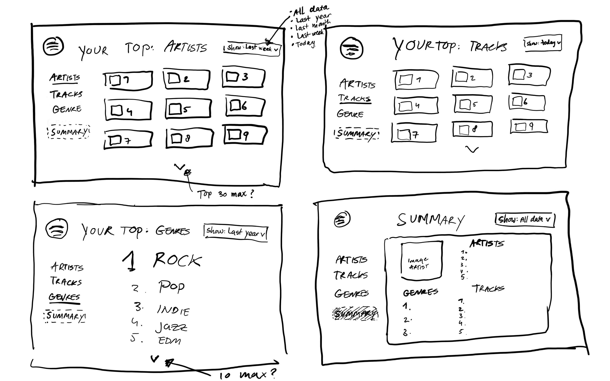
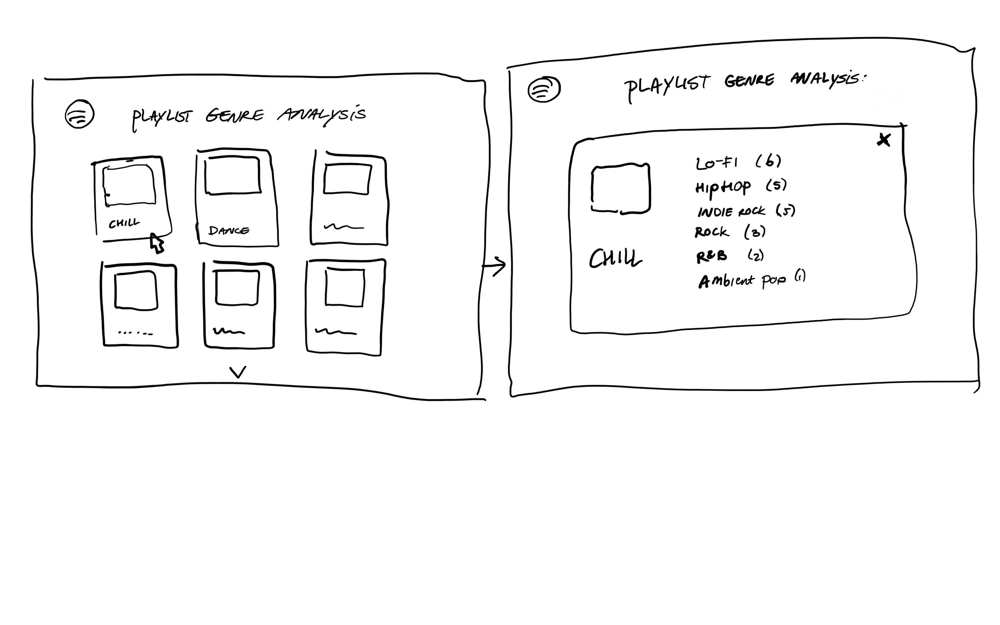

# Project proposal: React App for Spotify users
By Seda den Boer

## Application goal summary
Create a React App inspired by Spotify Wrapped.

## Problem statement
Spotify is one of the most popular music streaming platforms. Every year users get their Spotify Wrapped, which shows them which artists, tracks and podcasts defined them that year. As music can be a great indicator of someone's personality, people often get excited to see and share their Spotify Wrapped. However, music enthousiasts might want more insights and tools to analyze their listening habits all year long. 

## Solution sketch
This application will make it possible for users to analyze their Spotify listening behaviour all year long. Ideas for possible features are:

### Main feature
* Top tracks, artists, genres, (albums and podcasts). Time frame options are; all data, last year, last month, last week.

### Additional feature ideas
* Add 30 second snippets of audio to the top tracks and artist when you click them (based on Thirtify app).
* Basic listening statistics and developments in listening behaviour, with regards to the categories mentioned above.
* Mood analysis (happy, sad, ...).
* Show favourite songs from all represented decades from your music.
* Playlist genre analysis.
* Save Discover Weekly.
* Select genres and generate a custom playlist.
* Generate playlist based on most popular song every month.

Below are two sketches of a few ideas, more will be worked out if there is enough time.

## Prerequisits
### Data sources
For this application I will use the Spotify API which provides endpoints that give access to a lot of information about user profiles, artists, tracks, albums, playlists, etc. Their website already has an overview of all the endpoints you can access and the information you can retrieve from them. When you want to use the Spotify API in a web app, authorization is also needed nad also you need to sign up your web app. Additional information about using the Spotify API can be found here: https://developer.spotify.com/documentation/web-api/ . To retrieve the data from Spotify you also need to setup a server. Possible frameworks are Flask and fastAPI, both based on python.
Useful data sources:
* Spotify Web API: https://developer.spotify.com/documentation/web-api/reference/#/
* Development guides - Authorization: https://developer.spotify.com/documentation/general/guides/authorization/
* React JS Tutorial - 06 How to get data from Spotify (playlists example): https://www.youtube.com/watch?v=dGFUQf5pcpk
* FastAPI: https://fastapi.tiangolo.com/
* Flask: https://flask.palletsprojects.com/en/2.0.x/
* CS50 Flask lecture: https://www.youtube.com/watch?v=GhB6Q7KC-SM

### External components
For the layout and displaying the top lists it would probably be easiest to use bootstrap. Additionaly, for extra nice visuals animation frameworks like React Reveal can be used. This will only be implemented if there is enough time. For the Spotify API to work with React a server will have to be set up like described above. For additional features, like statistics, something like Plotly can be used: https://plotly.com/javascript/.

### Similar web apps

#### Magic Playlist
Link: https://magicplaylist.co/#/?_k=9b92jp, https://github.com/loverajoel/magicplaylist

Function: Creates playlists based on a song.

This app was build with React. This guy also used a Spotify-SDK: https://github.com/loverajoel/spotify-sdk . The full pseudocode algorithm is in his README.md (second GitHub link above), which can be very useful for creating a similar side feature in my app. 

#### Discover Quickly
Link: https://discoverquickly.com/

Function: Enables the user to quickly scan through songs, by playing snippets of them, and save them.

The nice thing about this app is that you can hear snippets of the song by hovering over the icons with your mouse. I could not find the GitHub repository for this app, but by inspecting the website it shows that the creators placed all the songs in a grid with class='playable'. I think it would be best to also use a grid and create a separate hover/click function to make songs playable.

#### Replayify
Link: https://replayify.com/app, https://github.com/palampinen/replayify

Function: Tracks favourite artists and songs.

This app was build with React as well and very similar to what I want to make. I think it's also nice that genres are displayed beneath the song. However, I'd like to add some more functionality to the app besides displaying the top tracks and artists. Clicking on songs leads to opening the song on Spotify and I think it would be nicer to have the 30 second snippet functionality instead of this. I would also like to have the user look at more different time frames besides all data, last year and last six months. 

### Difficulties
Figuring out the authorization, getting the actual data from Spotify (network request) by setting up a server, making hooks to get tokens, handling errors (e.g. rate limits). To overcome, these I will have to dive into these topics with the help of TA's. Since the Spotify API is very widely known there are also a lot of forum posts and tutorials for it available. Spotify itself also provides a very extensive guide on how to use their API and possible errors (like the rate limits) and what to do.