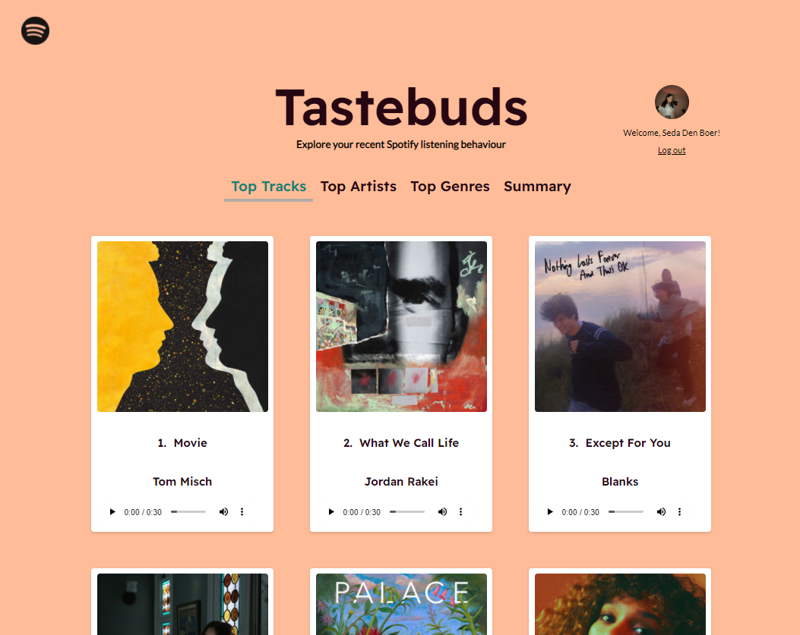
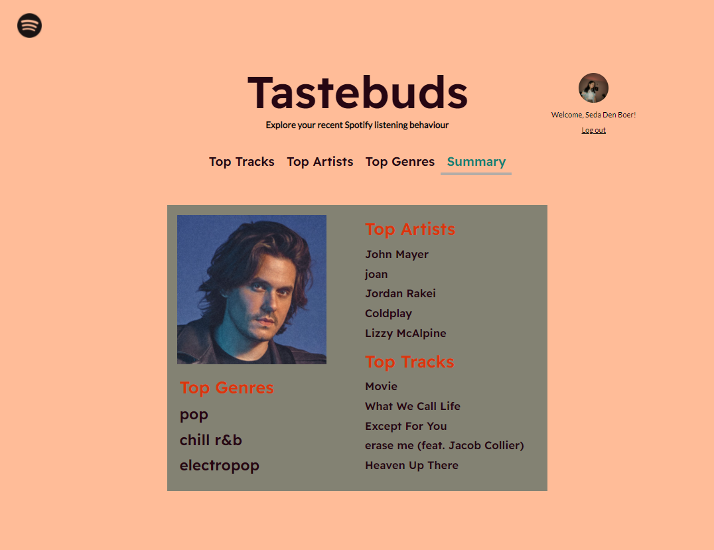

# Tastebuds
React App for Spotify users.

## Description
Spotify is one of the most popular music streaming platforms. Every year users get their Spotify Wrapped, which shows them which artists, tracks and podcasts defined them that year. As music can be a great indicator of someone's personality, people often get excited to see and share their Spotify wrapped. However, music enthousiasts might want more insights and tools to analyze their listening habits all year long. 

Tastebuds is a simple browser app that displays the user's top Spotify tracks, artists and genres. It is intended to provide a clean interface with a focus on visuals and intuitive controls.

### Availability and running the app
Currently the app is not launched or available to the public since it requires a user credentials, but this might change in the future. Updates about this will be announced here.

For now http//localhost:8888/callback is used as the redirect uri while running the app locally. For the authorization server and start client, npm dependencies need to be installed (`npm install`), as well as an up-to-date version of Node.js: https://docs.npmjs.com/downloading-and-installing-node-js-and-npm.

## Screenshots

## Acknowledgements
- [Spotify Web API Development Guides](https://developer.spotify.com/documentation/web-api/quick-start/) + [Spotify Web API Tutorial](https://developer.spotify.com/documentation/web-api/quick-start/): Authorization guides and API usage guides by Spotify.
 - [Spotify Accounts Authentication Examples](https://github.com/spotify/web-api-auth-examples): a repository containing source code for setting up a Node.js based server with OAuth 2.0 flows for Spotify Web API authetication. This repository is cloned in my own project under the name auth-server.
 - [spotify-web-api-js](https://github.com/jmperez/spotify-web-api-js): a Spotify Web API library wrapper with helper functions for Spotify's API data endpoints.
  - [react-tabs](https://github.com/reactjs/react-tabs): tab component for ReactJS.
- [MUI](https://mui.com/): React UI library (used for grid component).

## Authors
- [@sedadenboer](https://www.github.com/sedadenboer)

## License
Copyright © 2021 Seda den Boer

All Rights Reserved.
