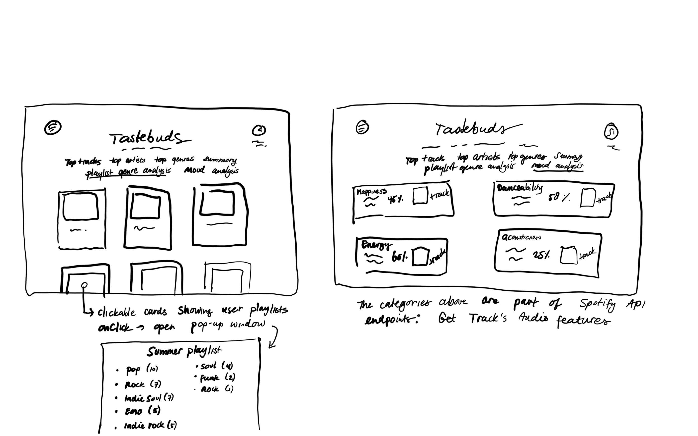
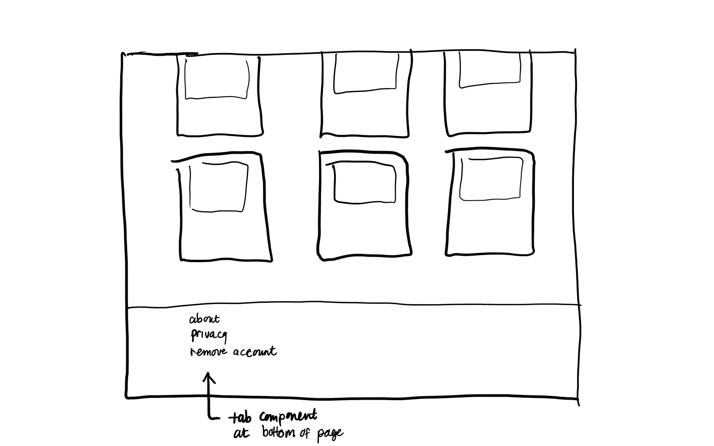

# Review
Code reviewer: Eva Biesot

## Points of improvement

### Code and styling
* Code for top genres
To retrieve genre data, you have to use the Top Artists endpoint. For now, I used useEffect twice while also using `spotifyApi.getMyTopArtists()` twice. Since the Top Artists page and the Top Genres page use the same endpoint, this code could be combined for more efficiency. Important then is to make it clear what a certain block of code is doing and where in your app it will show (e.g. what page).

* Positioning of items on a page
Some items (div's, images, ...) are placed at some place on the screen manually. For example, the Spotify logo, heading and user login icon kept influencing each other's place on the screen. I wanted the heading and Spotify logo to be in the exact same spot for the login page and the main page but I couldn't get this fixed. I solved this by adjusting the CSS properties of these elements manually to make them look positioned the same. Also the heading components move differently on the login page when you reduce the screen in size, compared to the main page. To solve this, CSS properties have to be adjusted with respect to all the items on the page. For example, the main page the heading is influenced a lot by the placing of the Spotify logo and the user profile icon and the text underneath it. The login page doesn't have this user icon and text. 

* Consistency for different browsers
In Firefox the color of the audio player cannot be adjusted, so its default color is black.

* Do more with errors
Errors are only displayed in the console. Some errors can be useful to be displayed to the user. For example, if the login session is expired (authorization) you get a 401 error in the console and the user will see the main but without their content. When this happens the user should be redirected to the login page, possibly with a message that the session is expired.

* Commenting
Now the comments are very long since I wanted to make really clear what the code is doing and returning. Some could be formulated shorter or more efficiently. Besides the code is lacking a short summary about the structure and purpose of the code for every file. This way you can quickly have insights in the file without having to read all the code. Also add comments to `if (!token) return` to interpret what happens here.

* Follow React.js style guidelines

### More features with regards to the goal of the app
The initial goal of this project was to create an app for Spotify users so that they could get insights in their listening behaviour all year long. Basic features like top tracks, artists and genres are present. However, for this app to be more interesting I would have added more features since the Spotify Web API has a lot to offer. A few examples are:

* Add a dropdown menu to change the time range of the fetched data. The Spotify Web API allows you to get short term data, mid term data and long term data. This also creates a possibility to do more with time comparison features.
* Ability to click top artist cards and redirect to their Spotify account
* A few top songs from all represented decades
* Display favourite songs for every decade
* Playlist genre analysis.
* [Mood analysis](https://developer.spotify.com/documentation/web-api/reference/#/operations/get-audio-features)

Below is a sketch of two of the features I listed above:

Essentially, the idea is to create more tabs with different features. 

### Hosting and deploying my app
For now the app can only be accessed locally with the client credentials I received by registering my app at Spotify. To make it available for other users I need to host and deploy my app. A possible service could be [Netlify](https://www.netlify.com/). 

### About page, privacy statement and delete account
Crucial parts of app's for which user login is required, especially with authorization, is a privacy statement and the option to remove your account. This way the user knows what their data will be used for and the user can always remove authorization. An about page could also be very informative. Things that could be included here are: author information, goal of the app, FAQ, credits, etc. 

